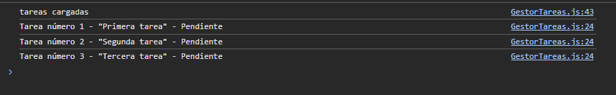
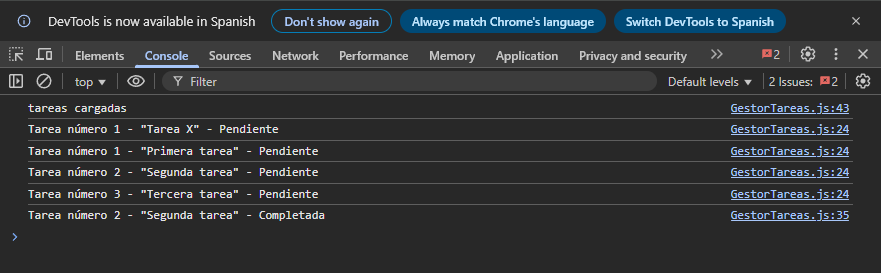
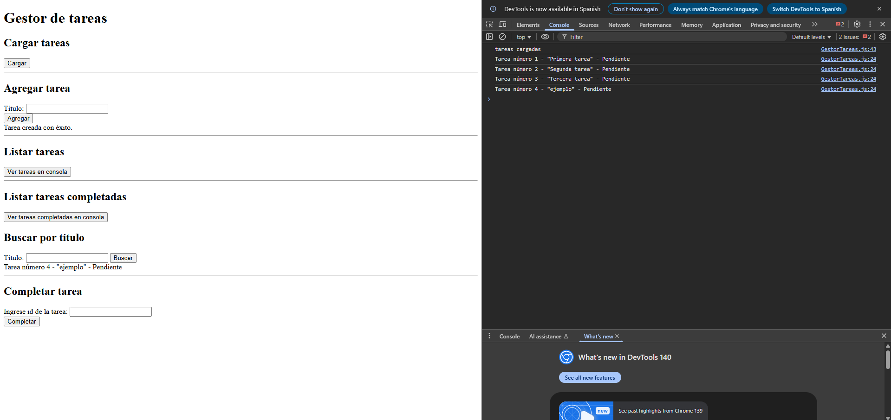

# Formulario interactivo con validación en clases

## Descripción
Este proyecto consiste en la creación de un gestor de tareas en JavaScript avanzado, utilizando clases, asincronía y métodos de arrays para manipular datos.
El objetivo es practicar la creación de clases con propiedades y métodos, la simulación de asincronía con Promesas y setTimeout, y el uso de funciones de orden superior como filter, find y forEach.

## Cómo usar
1. Clonar el repositorio:
   ```bash
   git clone https://github.com/BrunoBoccasile/diplofullstack_tarea_3.git
2. Abrir el archivo index.html en cualquier navegador moderno (Chrome, Firefox, Edge, Safari).

## Funcionalidad

### Clase Tarea

- Propiedades: id, titulo, completada.

- Método: toggleEstado() → cambia el estado de la tarea entre true/false.

### Clase GestorTareas

#### Contiene un array de tareas.

#### Métodos principales:

- agregarTarea(titulo) → agrega una nueva tarea.
- listarTareas() → muestra todas las tareas con forEach.
- buscarPorTitulo(titulo) → devuelve la tarea que coincide con el título.
- listarCompletadas() → filtra y devuelve solo las tareas completadas.

### Simulación Asíncrona

- Función cargarTareas() → devuelve una promesa que simula carga de datos inicial con setTimeout (2 segundos).

### Flujo del programa (con async/await)

- Espera la carga inicial de tareas.
- Muestra en consola: "Tareas cargadas correctamente".
- Lista las tareas iniciales.
- Permite agregar una nueva tarea y volver a mostrar el listado.
- Filtra y muestra las tareas completadas.

## Fuentes

- Bibliografía: [W3Schools](https://www.w3schools.com/)

## Capturas de pantalla






## Créditos
- Autor: Bruno Boccasile
- Curso: React JS
- Unidad: 3